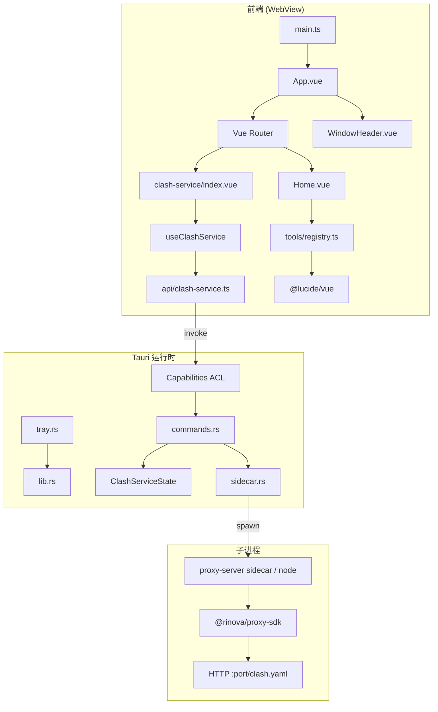

# 架构审查

> 最后更新：2026-07-05 · registry 驱动路由 + api 层 + Lucide

## 整体架构



## 分层职责

### 表现层

| 模块 | 职责 |
|------|------|
| `App.vue` | 窗口壳、`router-view`、关闭、标题双击回首页、`init_window` |
| `Home.vue` | registry 工具列表、运行中 badge、Lucide 图标卡片 |
| `clash-service/index.vue` | 表单与操作 UI，逻辑委托 `useClashService` |
| `WindowHeader.vue` | 拖拽、Lucide `X` 关闭、标题双击 emit |

### 路由层

- `createMemoryHistory()` — 桌面应用无地址栏
- **registry 驱动路由** — `tools.map` 展开 `/tool/*`，新工具只改 registry ✅

### 业务逻辑层（前端）

| 模块 | 职责 |
|------|------|
| `useClashService.ts` | Clash UI 状态机、prefs、端口提示、启停/刷新/复制 |
| `clash-prefs.ts` | localStorage 读写与校验 |
| `registry.ts` | 工具 meta + 懒加载 component + `LucideIcon` |

### IPC 层

| Command | 作用 |
|---------|------|
| `start_service(url, port, allow_fallback?)` | 启动 sidecar/node proxy |
| `stop_service()` | 停止子进程 |
| `get_service_status()` | 运行状态 + runner |
| `check_port` / `reclaim_port` | 端口占用与回收 |
| `refresh_service()` | 手动刷新订阅 |
| `init_window()` | macOS 圆角 |

封装于 `src/api/clash-service.ts`（typed invoke，箭头函数）。

### 原生层

- `ClashServiceState`：子进程与 active URL 管理
- `sidecar.rs`：release 用 pkg 二进制，dev 可回退 Node
- `tray.rs`：关窗隐藏、托盘退出清理
- `shortcut.rs`：Cmd/Ctrl+Shift+V 唤起窗口

## 数据流（Clash 工具）

```
用户输入 URL + 端口（localStorage 自动恢复）
  → useClashService.handleStart
  → api.startService → invoke('start_service')
  → Rust prepare_listen_port（可选 reclaim）
  → sidecar spawn proxy-server
  → HTTP GET /clash.yaml
  → UI 显示 base_url/clash.yaml + Lucide 状态区
```

停止：`handleStop` → `stop_service` → SIGTERM → 托盘退出亦会清理

## 样式架构

- 全局：`main.less` CSS 变量（`--void-*`）
- 组件：scoped Less + BEM 风格类名
- 图标：`@lucide/vue`，`currentColor` 继承主题色
- 输入区局部 `user-select: text`

## 架构优点

- 工具按目录隔离（`src/tools/<id>/`）
- registry 单一数据源（路由 + 首页 + 图标）
- composable 分离 UI 与 IPC
- typed api 层统一 invoke
- Rust 统一管理子进程与安全（SSRF、端口回收）
- release sidecar 免用户 Node

## 已解决的历史风险

| 原风险 | 现状 |
|--------|------|
| Node 运行时外依赖 | ✅ pkg sidecar |
| registry/router 重复 | ✅ registry 驱动 router |
| 无 api 封装层 | ✅ `api/clash-service.ts` |
| Capabilities 缺口 | ✅ `allow-clash-service` |
| emoji/内联 SVG 图标 | ✅ Lucide 组件 |

## 剩余风险

| 风险 | 严重度 | 说明 |
|------|--------|------|
| stdout pipe 未读 | P2 | 子进程日志量大时可能阻塞 |
| 单工具规模 composable 膨胀 | P3 | 新工具应独立 composable |

## 目标演进（Phase 4+）

```
tauri-plugin-updater     → 自动更新
tauri-plugin-store       → 可选 Rust 侧 prefs
i18n                     → 多语言
更多 tools/registry 条目  → 生态扩展
```
