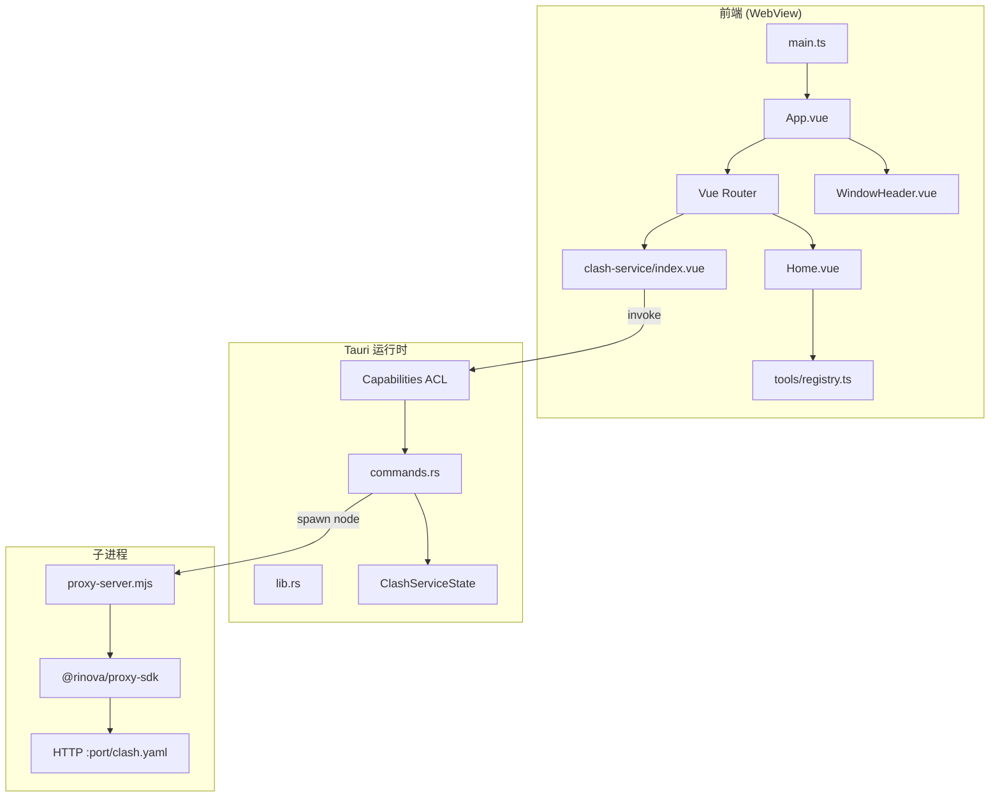

# 架构审查

> 最后更新：2026-07-05 Round 3

## 整体架构



## 分层职责

### 表现层

| 模块 | 职责 |
|------|------|
| `App.vue` | 窗口壳、`router-view`、关闭、标题双击回首页 |
| `Home.vue` | 从 registry 渲染工具列表，`router.push` |
| `clash-service/index.vue` | URL/端口表单，invoke start/stop |
| `WindowHeader.vue` | 拖拽、关闭、标题双击 emit |

### 路由层

- `createMemoryHistory()` — 适合桌面，无 URL 栏
- 路由与 registry **双处定义**（已知技术债，见 R3-4）

### IPC 层

| Command | 作用 |
|---------|------|
| `start_service(url, port)` | spawn `node proxy-server.mjs` |
| `stop_service()` | SIGTERM / kill 子进程 |
| `get_service_status()` | 返回 `running` / `stopped` |

前端直接在组件内 `invoke()`，无 `src/api/` 封装层。

### 原生层

- `ClashServiceState`：`Mutex<Option<Child>>` + script_path
- setup 解析 dev / resource 路径下的 `scripts/proxy-server.mjs`

## 数据流（Clash 工具）

```
用户输入 URL + 端口
  → invoke('start_service')
  → Rust spawn node
  → proxy-server.mjs → startServer({ url, port })
  → HTTP GET /clash.yaml
  → UI 显示 http://127.0.0.1:port/clash.yaml
```

停止：`invoke('stop_service')` → SIGTERM → SDK server.close()

## 样式架构

CSS 变量主题（`main.less`），工具内局部 `user-select: text`（Clash 输入框/URL）。

## 架构优点

- 工具按目录隔离（`src/tools/<id>/`）
- registry 集中注册 meta
- Rust 统一管理子进程生命周期
- `bundle.resources` 打包脚本

## 架构风险（Round 3）

| 风险 | 严重度 | 说明 |
|------|--------|------|
| Node 运行时外依赖 | P0 | release 不含 node_modules |
| registry/router 重复 | P1 | 新工具易漏改 |
| stdout pipe 未读 | P1 | 子进程可能阻塞 |
| Capabilities 缺口 | P0/P1 | 自定义 command 可能无 ACL |
| 无 api 封装层 | P2 | invoke 分散，难统一错误处理 |

## 建议的目标演进

```
src/tools/registry.ts     → 含 lazy component，驱动 router
src/api/clash-service.ts  → typed invoke 封装
src-tauri/permissions/    → command ACL
scripts/proxy-server.mjs  → esbuild 单文件 bundle
```
