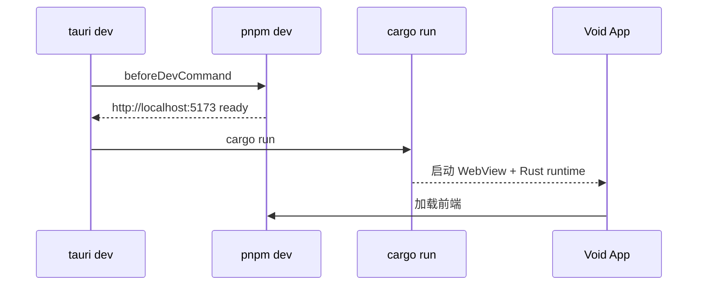

# 构建与部署

## 开发环境要求

| 工具 | 最低版本 | 用途 |
|------|----------|------|
| Node.js | 18+ | 前端构建 |
| pnpm | 8+ | 包管理 |
| Rust | 1.77.2+ | Tauri 后端 |
| 平台 SDK | — | macOS: Xcode CLT; Windows: VS Build Tools; Linux: webkit2gtk 等 |

## 常用命令

```bash
# 安装依赖
pnpm install

# 仅前端开发（浏览器预览，无 Tauri 能力）
pnpm dev

# Tauri 开发模式（前端 + Rust 热重载）
pnpm tauri:dev

# 前端生产构建
pnpm build

# Tauri 生产打包（生成安装包）
pnpm tauri:build
```

## 构建流程

### 开发模式 (`pnpm tauri:dev`)



### 生产模式 (`pnpm tauri:build`)

```
1. beforeBuildCommand: pnpm build:all
   ├── pnpm build:proxy     (esbuild bundle)
   ├── pnpm build:sidecar   (pkg → binaries/proxy-server-{triple})
   └── pnpm build           (vue-tsc + vite → dist/)
2. cargo build --release
3. tauri bundle            (含 externalBin sidecar)
```

## 构建产物

| 平台 | 输出路径 | 格式 |
|------|----------|------|
| macOS | `src-tauri/target/release/bundle/macos/` | `.app`, `.dmg` |
| Windows | `src-tauri/target/release/bundle/msi/` | `.msi`, `.exe` (NSIS) |
| Linux | `src-tauri/target/release/bundle/deb/` 等 | `.deb`, `.AppImage` |

当前 `bundle.targets: "all"` 会在支持的平台上构建所有格式。

## 构建验证结果

| 检查项 | 结果 | 时间 |
|--------|------|------|
| `pnpm build` | ✅ | 2026-07-05 R7 |
| `pnpm build:sidecar` | ✅ | 2026-07-05 R7 |
| `cargo check` | ✅ | 2026-07-05 R7 |
| CI (ubuntu) | ✅ | build + sidecar + check |
| `pnpm tauri:build` | ⚠️ 未全平台验证 | — |

构建输出：

```
dist/index.html                  0.39 kB
dist/assets/index-Bld1-jhg.css   2.43 kB
dist/assets/index-Ce3DSxC3.js   76.74 kB
```

前端包体积 76 KB（gzip 28 KB），非常轻量。

## 版本管理

| 文件 | version | Round 3 |
|------|---------|---------|
| package.json | 0.1.0 | ✅ |
| tauri.conf.json | 0.1.0 | ✅ |
| Cargo.toml | 0.1.0 | ✅ |

## Round 3 打包注意

### 构建脚本（Round 4）

```json
"build:proxy": "esbuild ... proxy-server.bundle.cjs",
"build:all": "pnpm build:proxy && pnpm build",
"beforeDevCommand": "pnpm build:proxy && pnpm dev",
"beforeBuildCommand": "pnpm build:all"
```

### 资源打包

```json
"resources": [
  "scripts/proxy-server.bundle.cjs",
  "scripts/proxy-server.mjs"
]
```

bundle 约 19k 行 CJS，**不含 Node 二进制**。

### 构建验证（2026-07-05 Round 4）

| 检查 | 结果 |
|------|------|
| `pnpm build` | ✅ |
| `cargo check` | ✅ |

## 发布清单

### 首次发布前

- [ ] 统一版本号
- [ ] 更新 README（非 Vue 模板内容）
- [ ] 配置应用图标（已有 icons 目录）
- [ ] 填写 Cargo.toml 元信息（authors, license, description）
- [ ] 配置 CSP
- [ ] 测试 macOS / Windows 打包
- [ ] 代码签名（macOS notarization / Windows Authenticode）

### 图标资源

已有图标文件：

```
src-tauri/icons/
├── 32x32.png
├── 128x128.png
├── 128x128@2x.png
├── icon.icns        (macOS)
├── icon.ico         (Windows)
├── icon.png
├── Square30x30Logo.png
└── Square44x44Logo.png
```

图标齐全，可直接用于打包。

## CI/CD 建议

当前无 CI 配置。建议 GitHub Actions workflow：

```yaml
name: CI

on: [push, pull_request]

jobs:
  frontend:
    runs-on: ubuntu-latest
    steps:
      - uses: actions/checkout@v4
      - uses: pnpm/action-setup@v4
      - uses: actions/setup-node@v4
        with: { node-version: 20, cache: pnpm }
      - run: pnpm install
      - run: pnpm build

  tauri:
    strategy:
      matrix:
        platform: [macos-latest, ubuntu-latest, windows-latest]
    runs-on: ${{ matrix.platform }}
    steps:
      - uses: actions/checkout@v4
      - uses: pnpm/action-setup@v4
      - uses: actions/setup-node@v4
      - uses: dtolnay/rust-toolchain@stable
      - uses: tauri-apps/tauri-action@v0
        with:
          args: --no-bundle
```

## 环境变量

当前项目未使用环境变量。后续可考虑：

| 变量 | 用途 |
|------|------|
| `TAURI_DEV_HOST` | 远程开发调试 |
| `VITE_APP_VERSION` | 前端显示版本号 |
| `VITE_API_URL` | 若工具有网络请求 |

Vite 配置需添加 `envPrefix: ['VITE_', 'TAURI_']` 以支持 Tauri 环境变量。

## .gitignore 审查

```
node_modules, dist, dist-ssr     ✅
src-tauri/target/                ✅ (via src-tauri/.gitignore)
src-tauri/gen/schemas            ✅
*.local                          ✅
.DS_Store                        ✅
```

无遗漏项。
