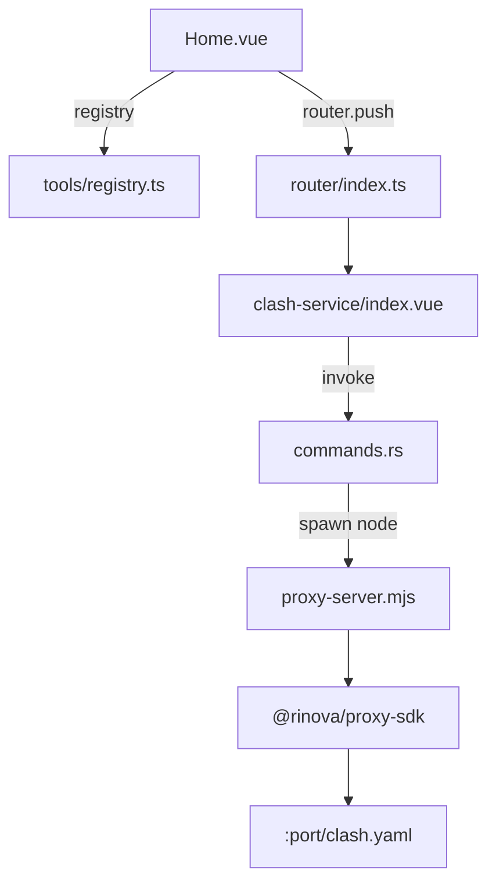

# 第三轮审查报告

> 审查日期：2026-07-05  
> 文档路径：`plan/review/`  
> 对照基准：Round 2 + [FIX-PLAN.md](./FIX-PLAN.md) Batch 2

## 审查范围

项目在 Round 2 之后进入 **Phase 1/2 交叉阶段**：工具注册表、Vue Router、Rust IPC、首个真实工具（Clash 订阅服务）均已落地。本轮对新增模块做专项走查，并验证 Round 2 待办 closure 情况。

## 与 Round 2 的变化摘要

| 类别 | Round 2 | Round 3（当前） |
|------|---------|-----------------|
| 工具注册表 | ❌ | ✅ `src/tools/registry.ts` |
| Vue Router | ❌ | ✅ memory history + 懒加载 |
| IPC 命令层 | ❌ | ✅ `commands.rs`（3 个 command） |
| 首个真实工具 | ❌ | ✅ Clash 订阅服务 |
| package.json 版本 | ❌ 0.0.0 | ✅ 0.1.0 |
| README | ❌ Vue 模板 | ✅ Void 介绍（有小偏差） |
| favicon | ❌ | ✅ SVG |
| App.vue scoped | ❌ | ✅ |
| `@/` 别名 | 配置未用 | ✅ 已使用 |
| 不规则窗口遮罩 | ❌ | ❌ 仍未实现 |
| 前端 `src/api/` 封装 | ❌ | ❌ invoke 直调 |
| Capabilities 扩展 | — | ❌ 未声明自定义 command 权限 |
| 测试 / CI | ❌ | ❌ |

## 新架构概览



## Round 3 新发现问题

### R3-1：生产环境 Node 依赖链未闭合（P0）

`proxy-server.mjs` 使用 ESM `import '@rinova/proxy-sdk'`，Rust 通过 `Command::new("node")` 启动。

| 环境 | 风险 |
|------|------|
| 开发 | 依赖本机 Node + 项目根 `node_modules`，通常可用 |
| 打包 release | 仅 `scripts/*` 打入 resources，**不含** `node_modules` 与 SDK |
| 用户机器 | 需预装 Node 且能 resolve SDK — 不可接受 |

**建议**：esbuild 将 `proxy-server.mjs` 打包为单文件；或 Rust 内嵌 HTTP 服务，消除 Node 子进程。

---

### R3-2：Capabilities 未授权自定义 command（P0/P1）

`capabilities/default.json` 仍只有：

```json
["core:default", "core:window:allow-close"]
```

Tauri 2 对自定义 `invoke` 通常需显式 permission（如 `allow-start-service`）。构建产物 `__app__-permission-files` 为空数组。

**风险**：运行时 `invoke` 可能被 ACL 拒绝（视 Tauri 版本/配置而定）。

**建议**：在 `src-tauri/permissions/` 声明 command 权限，并写入 `default.json`。

---

### R3-3：启动检测与文档不一致（P1）

`proxy-server.mjs` 注释称 Rust 通过 stdout `VOID_SERVER_READY` 确认就绪；`commands.rs` 实际仅：

```rust
std::thread::sleep(Duration::from_millis(500));
child.try_wait()
```

问题：
- 未读取 stdout/stderr
- stdout/stderr 被 `piped()` 但未消费 → **管道缓冲区满可导致子进程阻塞**
- 500ms 竞态：慢启动误判成功，快失败可能漏检

**建议**：读取 stderr 至 `VOID_SERVER_READY` 或改 health check HTTP 探活；不要长期 pipe 而不读。

---

### R3-4：路由与注册表双处维护（P1）

| 文件 | 内容 |
|------|------|
| `registry.ts` | tool meta + `route: '/tool/clash-service'` |
| `router/index.ts` | 硬编码同一路由与 component import |

新增工具需改两处，违反 DRY。

**建议**：registry 携带 `component` 或路由表由 registry 生成。

---

### R3-5：`get_service_status` 未使用（P2）

Rust 已实现，前端 Clash 工具未在 `onMounted` 拉取状态。进程异常退出后 UI 可能仍显示「运行中」。

---

### R3-6：Clash 工具无返回导航（P2）

仅 WindowHeader 标题 **双击** 回首页（`App.vue goHome`），工具页无返回按钮，可发现性差。

---

### R3-7：README 与代码不一致（P2）

README 列出 `stores/` Pinia，但项目中 **无** `src/stores/`，也未安装 pinia。

---

### R3-8：Rust 输入校验不足（P2）

`start_service(url, port)` 未校验 URL  scheme、port 范围；依赖前端 input约束。

---

### R3-9：Windows 停止逻辑（P3）

`stop_service` 非 Unix 走 `child.kill()`；`proxy-server.mjs` 仅注册 `SIGTERM`/`SIGHUP`，Windows 行为待验证。

---

### R3-10：serde 仍未使用（P3）

`Cargo.toml` 中 serde/serde_json 无对应 struct/command 序列化用途（command 参数由 Tauri 宏处理）。

## 已验证项

| 检查 | 结果 |
|------|------|
| `pnpm build` | ✅ 2026-07-05 |
| `cargo check` | ✅ |
| 模块数 | 47（含 clash-service 懒加载 chunk） |
| JS 主包 | ~105 KB（gzip ~39 KB） |
| `bundle.resources` | ✅ `scripts/*` |

## 更新后的评分

| 维度 | R2 | R3 | 说明 |
|------|----|----|------|
| 产品可用性 | 1 | **3.5** | 首个工具可用（dev 环境） |
| 架构完整度 | 2 | **4** | registry + router + IPC 成型 |
| 发布就绪度 | 2 | **2** | Node/SDK 打包链未闭合 |
| 安全/权限 | 4 | **3** | command 权限、URL 校验 |
| 代码质量 | 3.5 | **3.5** | 管道/竞态待修 |
| 文档准确度 | 3 | **3.5** | README 有小偏差 |

## 开放问题统计

| 优先级 | R2 开放 | R3 开放 |
|--------|---------|---------|
| P0 | 2 | **3**（+生产 Node 链） |
| P1 | 3 | **4** |
| P2 | 6 | **7** |
| P3 | 8 | **8** |
| **已关闭（累计）** | 4 | **~12** |

## 建议下一步（Batch 3）

1. **P0** esbuild 打包 proxy-server 或 Rust 原生 HTTP
2. **P0/P1** Capabilities 添加 command 权限
3. **P1** 修复 stdout 管道 + 就绪检测
4. **P1** registry 驱动路由，消除双处维护
5. **P2** Clash 工具加返回按钮 + mount 时 `get_service_status`
6. **P2** 修正 README（移除 Pinia/stores）

详见 [FIX-PLAN.md](./FIX-PLAN.md)、[06-issues-and-recommendations.md](./06-issues-and-recommendations.md)。
