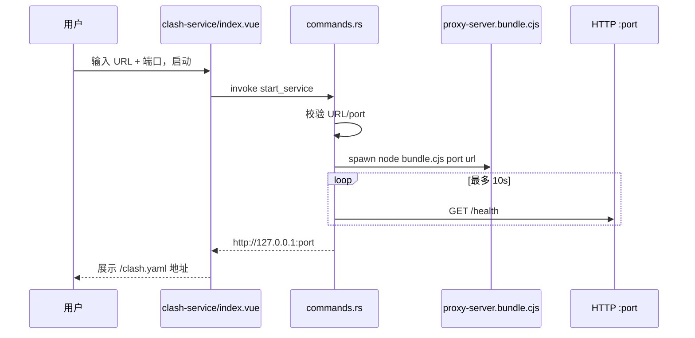

# Round 4 审查 — Clash 工具专项

> 审查日期：2026-07-05  
> 范围：`clash-service` 全链路（UI → IPC → Rust → Node bundle → SDK）  
> 重点：**边界情况** + **用户体验**

## 相对 Round 3 的进展

| Round 3 问题 | Round 4 状态 |
|--------------|--------------|
| 生产 Node/SDK 链 | ✅ `esbuild` → `proxy-server.bundle.cjs`，`build:proxy` / `build:all` |
| stdout 管道阻塞 | ✅ stdout/stderr → null |
| 就绪检测不可靠 | ✅ HTTP `/health` 探活（10s 超时） |
| registry/router 双维护 | ✅ registry 驱动路由 |
| Rust URL/port 校验 | ✅ 部分（scheme + port≥1024） |
| 返回按钮 | ✅ `← 返回` |
| mount 状态同步 | ⚠️ 有，但不完整（见 R4-UX-1） |
| Capabilities | ❌ 仍未声明 |
| 应用退出清理 | ❌ 无 RunEvent |
| invoke 封装层 | ❌ 仍直调 |

## 当前链路（Round 4）



---

## 一、边界情况审查

### 1.1 启动阶段

| ID | 场景 | 当前行为 | 风险 | 优先级 |
|----|------|----------|------|--------|
| EC-01 | **端口已被占用**（非本服务） | health 可能误判为就绪（若占用者也有 `/health` 200）或超时失败 | 用户以为启动成功/错误信息模糊 | P1 |
| EC-02 | **端口已被占用**（上次孤儿进程） | 同上；Rust state 为空但端口仍监听 | 无法启动，需手动杀进程 | P1 |
| EC-03 | **订阅 URL 无效 / 网络失败** | 子进程 exit → Rust 报「进程异常退出」；stderr 已丢弃，**无具体原因** | 用户无法排查 | P1 |
| EC-04 | **订阅 URL 合法但解析慢** | 10s 内 health 未就绪 → 超时 kill | 慢网络误杀 | P2 |
| EC-05 | **本机无 Node** | `spawn` 失败 →「启动失败: ...」 | release 用户必须装 Node | P0 |
| EC-06 | **URL 仅空格** | 前端拦截；Rust 也会因 len<12 失败 | ✅ | — |
| EC-07 | **非 http(s) scheme** | Rust 拒绝 | ✅ | — |
| EC-08 | **端口 < 1024** | Rust 拒绝 | ✅ | — |
| EC-09 | **端口输入为空 / NaN** | `v-model.number` 空值可能为 `NaN` 或 `0`；Rust u16 收到 0 →「端口必须在 1024-65535」 | 前端无友好提示 | P2 |
| EC-10 | **服务已在运行（Rust state）** | 返回「服务已在运行 (port {新输入})」— **未显示实际端口** | 误导 | P2 |
| EC-11 | **重复点击启动** | starting 态隐藏按钮 | ✅ | — |
| EC-12 | **bundle 不存在** | fallback 到 `.mjs`，依赖 node_modules | dev 裸环境可能失败 | P2 |

### 1.2 运行阶段

| ID | 场景 | 当前行为 | 风险 | 优先级 |
|----|------|----------|------|--------|
| EC-13 | **子进程崩溃** | state 仍可能为 running 直到下次 `get_service_status` / 再操作 | UI 显示运行中但服务已死 | P1 |
| EC-14 | **离开工具页再返回** | `onMounted` 调 `get_service_status`；`serviceUrl` 用**默认 port 25500** 重建 | **非默认端口时 URL 错误** | P0 |
| EC-15 | **离开工具页再返回** | URL 输入框为空 | 用户不知当前订阅源 | P1 |
| EC-16 | **返回首页不停止服务** | 服务继续后台运行 | 符合预期但**无全局指示** | P2 |
| EC-17 | **关闭 Void 窗口** | **无** `RunEvent` / `Drop` 清理 | **孤儿 Node 进程** | P0 |
| EC-18 | **SDK 定时刷新失败** | 无 UI 反馈（60min interval） | 订阅静默过期 | P3 |

### 1.3 停止阶段

| ID | 场景 | 当前行为 | 风险 | 优先级 |
|----|------|----------|------|--------|
| EC-19 | **停止中重复操作** | stopping 态无停止按钮 | ✅ | — |
| EC-20 | **stop 时服务已死** | `get_service_status` 会清 state；stop 报「服务未运行」 | 可接受 | — |
| EC-21 | **SIGTERM 3s 超时** | force kill | ✅ Unix 合理 | — |
| EC-22 | **Windows 停止** | `child.kill()` 非 SIGTERM；bundle 只监听 SIGTERM | Windows 可能无法优雅 close HTTP | P2 |

### 1.4 安全边界

| ID | 场景 | 当前行为 | 风险 | 优先级 |
|----|------|----------|------|--------|
| EC-23 | **SSRF（内网 URL）** | SDK 拉取用户 URL，Rust 不限制 host | 用户误填内网地址 | P2 |
| EC-24 | **本地 HTTP 暴露** | 127.0.0.1 only（SDK 默认） | 低 | — |
| EC-25 | **Capabilities ACL** | 未声明 command 权限 | 部分环境 invoke 被拒 | P1 |

---

## 二、用户体验审查

### 2.1 评分总览

| 维度 | 评分 (1-5) | 说明 |
|------|-----------|------|
| 核心流程清晰度 | 4 | 表单 → 启动 → 地址展示，路径短 |
| 错误可理解性 | 2 | 缺 stderr/SDK 错误透传 |
| 状态反馈 | 3.5 | 有状态点/loading；stopping 无 actions 区反馈 |
| 恢复/续用 | 2 | 重进页面 port/url 丢失或不准确 |
| 操作效率 | 2.5 | **无复制按钮**、无 Enter 提交 |
| 可发现性 | 3 | 有返回；首页无「服务运行中」badge |
| 视觉/布局 | 4 | 400×500 内可滚动，accent 一致 |

### 2.2 流程走查

####  happy path ✅

1. 首页点「Clash 订阅服务」→ 进入工具
2. 填 URL + 端口（默认 25500）→ 启动
3. 等待「启动中...」（最多 ~10s）
4. 绿色「运行中」+ 显示 `http://127.0.0.1:25500/clash.yaml`
5. 用户复制到 Clash Verge → **无一键复制，需手动选中**

#### 痛点清单

| ID | 痛点 | 建议 |
|----|------|------|
| UX-01 | **无法一键复制**订阅地址 | 复制按钮 + toast「已复制」 |
| UX-02 | **Enter 不触发启动** | `@keyup.enter` on form |
| UX-03 | **错误后只有红字**，无「重试」引导 | 保留 error + 明确「请检查 URL/网络」 |
| UX-04 | **stopping 时 actions 区空白** | 与 starting 同样 loading |
| UX-05 | **运行中无法查看/修改 URL** | 只读展示当前 URL，或提示「停止后可修改」 |
| UX-06 | **重进工具页 port/url 不同步** | Rust 返回 `{ status, port, url, baseUrl }` 或持久化 state |
| UX-07 | **首页不知服务在跑** | Home 卡片 badge「运行中」或全局 indicator |
| UX-08 | **无「手动刷新订阅」** | 暴露 POST `/refresh` 按钮（SDK 已支持） |
| UX-09 | **无自动刷新说明** | 文案：「每 60 分钟自动刷新」 |
| UX-10 | **关闭窗口未提示** | 若 running，close 前 confirm 或 auto-stop |

### 2.3 可访问性

| 项 | 状态 |
|----|------|
| label 关联 input | ⚠️ 有 `<label>` 但未用 `for` + `id` |
| 返回按钮 aria | ❌ 无 `aria-label` |
| 错误区域 role | ❌ 未用 `role="alert"` |
| 状态仅颜色区分 | ⚠️ 有文字 backup |

---

## 三、代码级备注

### 3.1 `get_service_status` 信息不足

```typescript
// index.vue onMounted — 问题：port 硬编码默认
serviceUrl.value = `http://127.0.0.1:${port.value}` // port.value 可能不是实际端口
```

Rust 仅返回 `"running" | "stopped"`，应扩展为：

```rust
struct ServiceStatus {
  status: String,
  port: Option<u16>,
  url: Option<String>,
  base_url: Option<String>,
}
```

### 3.2 health_check 误判可能

```rust
resp.contains("200 OK") || resp.contains("\"status\":\"ok\"")
```

任意 127.0.0.1 上符合响应格式的服务均可骗过探活 → 启动前应用 **端口占用预检**（connect + 排除非本进程）。

### 3.3 proxy-server.mjs 注释过时

仍写「Rust 通过 VOID_SERVER_READY 确认」— 实际已改 health check，应更新 `plan/tool-clash-service.md` 与脚本注释。

### 3.4 release 仍依赖系统 Node

`Command::new("node")` — bundle 只解决了 SDK，**未嵌入 Node 运行时**。可选：打包 sidecar node、或 Rust 直接调 SDK（长期）。

---

## 四、Round 4 优先修复（Clash 专项 Batch 4）

| 顺序 | 项 | 类型 |
|------|-----|------|
| 1 | EC-14/15：`get_service_status` 返回 port+url | P0 |
| 2 | EC-17：应用退出时 `stop_service` | P0 |
| 3 | UX-01：复制订阅地址 | P1 |
| 4 | EC-01/02：启动前端口占用检测 | P1 |
| 5 | EC-03：捕获启动失败原因（stderr 文件或 exit code 映射） | P1 |
| 6 | UX-04/08/09：stopping UI、刷新按钮、interval 说明 | P2 |
| 7 | Capabilities command 权限 | P1 |

---

## 五、测试建议（手动用例）

| # | 步骤 | 期望 |
|---|------|------|
| T1 | 合法 URL + 默认端口启动 | 10s 内 running，health 200 |
| T2 | 错误 URL | 明确错误，可再次启动 |
| T3 | 端口被 `python -m http.server` 占用 | 失败或明确「端口占用」 |
| T4 | 运行中返回首页再进入 | **port/url/地址仍正确**（当前 FAIL） |
| T5 | 运行中关闭 Void | 子进程被清理（当前 FAIL） |
| T6 | 运行中停止 | idle，端口释放 |
| T7 | 无 Node 环境（PATH 无 node） | 友好错误提示 |
| T8 | release 包启动（仅 bundle） | 不依赖项目 node_modules |

---

## 相关文档

- 设计：[../tool-clash-service.md](../tool-clash-service.md)
- 后端：[03-backend-review.md](./03-backend-review.md)
- 问题跟踪：[06-issues-and-recommendations.md](./06-issues-and-recommendations.md)
- 修复计划：[FIX-PLAN.md](./FIX-PLAN.md)
